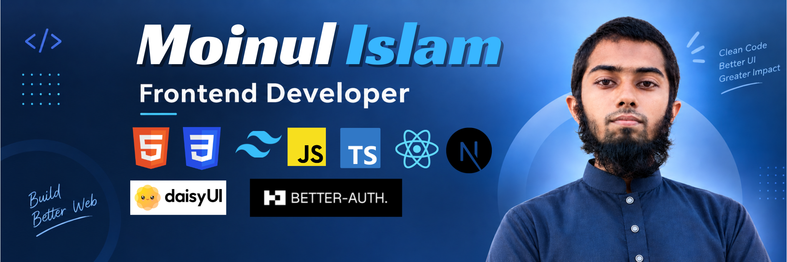

<!-- Banner -->

 

<!-- Introduction -->

# Hi 👋, I'm Moinul Islam

### CSE Student | Frontend Developer | React & Next.js | Building AI-powered web applications

 

<!-- About Me -->

## 👨‍💻 About Me

- 🎓 CSE Undergraduate
- 🌐 Building modern web applications with **React.js & Next.js**
- 💻 Currently improving my skills in **TypeScript, React and Next.js**
- 🛠️ Interested in **Full Stack Development & AI-powered applications**
- 📚 Currently learning **Node.js, Express.js, REST APIs and MongoDB**
- 🚀 I enjoy building projects and learning through hands-on development

 

<!-- Tech Stack -->

## 🧰 Tech Stack

### Languages

### Frontend

### Backend & Database

### Tools

### Deployment

 

<!-- Current Focus -->

## 🎯 Current Focus

- React.js
- Next.js
- TypeScript
- Full Stack Development
- REST API
- AI-powered Web Applications

 

<!-- Projects -->

## 🚀 Featured Projects

> Check out my pinned repositories below to see what I'm building.

 

<!-- GitHub Stats -->

## 📊 GitHub Statistics

 

<!-- Connect -->

## 🤝 Connect With Me

  

